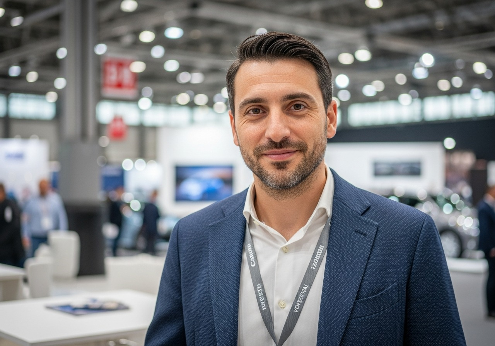
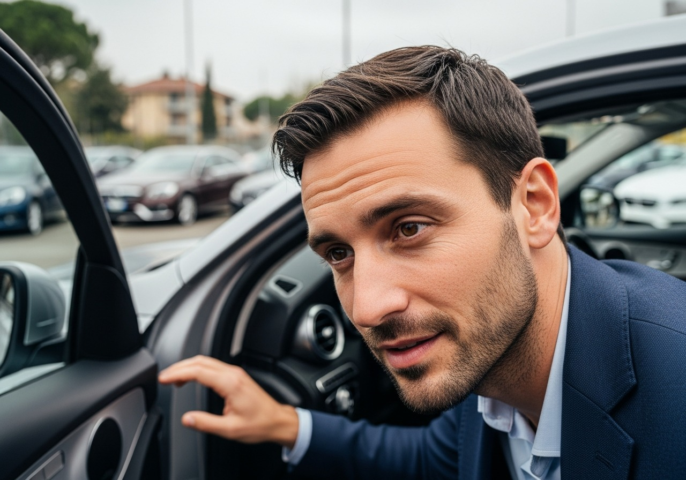
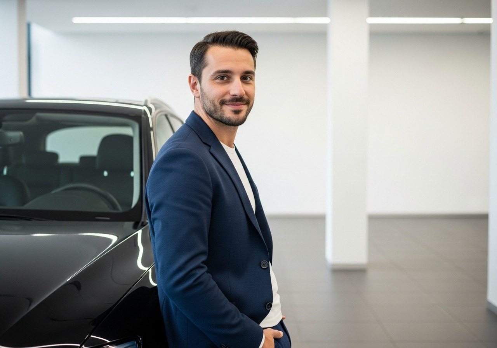

# ARGOS Automotive — UI/UX Spec: Integrazione Foto
**Versione**: 1.0 | **Data**: 2026-04-04
**Contesto**: Landing page B2B premium per dealer Sud Italia (target 50-65 anni, smartphone, diffidenti verso il digitale)

---

## Design System di riferimento

```
Sfondo:    #06060a (--bg) / #0c0c12 (--bg2) / #12121a (--bg3) / #1a1a24 (--surf)
Oro:       #c8a446 (--gold) / #e8c870 (--gold2)
Testo:     #e8e8f0 (--tx) / #a0a0b4 (--tx2) / #68687a (--tx3)
Border:    rgba(200,164,70,.12) (--brd) / rgba(200,164,70,.22) (--brd2)
Font:      Cormorant Garamond (titoli) / DM Mono (dati tecnici) / Inter (corpo)
Stile:     Luxury dark, minimal, gold accents
```

---

## Inventario foto

| ID | File | Aspect | Soggetto | Uso suggerito |
|----|------|--------|----------|---------------|
| P1 | luca_portrait_formal.jpg | 1:1 | Ritratto formale studio | Chi sono — card principale |
| P2 | luca_portrait_desk.jpg | 4:3 | Desk + skyline | CTA finale — sfondo |
| P3 | luca_portrait_casual.jpg | 1:1 | Outdoor golden hour | Chi sono — seconda foto trust |
| A1 | luca_showroom_bmw.jpg | 16:9 | Showroom BMW X3 | Hero — sfondo full-bleed |
| A2 | luca_inspecting_car.jpg | 4:3 | Ispezione auto | Protocollo — visual inline |
| A3 | luca_piazzale_tedesco.jpg | 16:9 | Piazzale EU | Differenziale/Numeri — background |
| A4 | luca_audi_showroom.jpg | 4:3 | Audi showroom | Fee — visual complementare |
| B1 | luca_handshake.jpg | 4:3 | Handshake meeting | Chi sono — badge trust |
| B2 | luca_working_laptop.jpg | 4:3 | Laptop in cafe | Steps Step 1 — thumbnail |
| B3 | luca_trade_fair.jpg | 4:3 | Fiera con badge | Chi sono — credenziale EU |
| B4 | luca_phone_call.jpg | 3:4 | Telefono lobby | Steps Step 1 — thumbnail alt |
| E1 | luca_munich_street.jpg | 4:3 | Monaco di Baviera | Mercati EU — background overlay |
| E2 | luca_port_logistics.jpg | 16:9 | Porto con navi | Footer alt / non necessario |
| E3 | luca_documents_review.jpg | 4:3 | Documenti close-up | Steps Step 2 — thumbnail |
| E4 | luca_car_transport.jpg | 16:9 | Bisarca BMW | Steps Step 3 — thumbnail |

---

## Regole generali per tutte le foto

### Trattamento unificato
- Overlay scuro su foto-background: `background: linear-gradient(rgba(6,6,10,.55), rgba(6,6,10,.55))`
- Overlay su foto-card con hover: `background: rgba(6,6,10,.30)` a riposo, `rgba(6,6,10,.10)` su hover
- Tutte le foto come `` con `loading="lazy"` eccetto Hero (hero usa `background-image`)
- `object-fit: cover` su tutti i contenitori foto
- `filter: grayscale(12%) contrast(1.05)` su tutte — uniforma il tono dark/gold
- Transizione hover: `transform: scale(1.03)` con `transition: transform .4s ease` + `overflow: hidden` sul wrapper

### Performance
- Dimensioni ottimali per web: max 1400px di larghezza per 16:9, max 900px per 4:3, max 600px per 1:1
- Formato: JPEG qualita' 82-88 (ottimo equilibrio peso/qualita')
- Hero (A1) usa `background-image` — preload con `<link rel="preload" as="image">`
- Tutte le altre foto: `loading="lazy"` + `decoding="async"`
- `srcset` per Hero: 1x (1200px) e 2x (2400px) per retina
- 4G dealer: Hero max 280KB, foto card max 120KB, thumbnail max 60KB

### Accessibilita'
- Alt text sempre descrittivo e non vuoto (vedere specifiche per sezione)
- `role="img"` su div con background-image + `aria-label`

### Animazioni scroll
- Classe `.rv-el` gia' presente nel codice — usarla per tutte le foto
- Nessun parallax (causa jank su mobile vecchi, specie Android 2019-2021)
- Fade-in dal basso: gia' implementato con IntersectionObserver esistente
- Hover zoom SOLO su foto-card, MAI su foto-background

---

## Sezione 1: HERO

### Obiettivo visivo
Impatto immediato. Il dealer apre la pagina e vede un ambiente che conosce (showroom BMW) con un uomo reale. Non uno stock photo anonimo. La prima impressione deve essere: "questa persona e' nel settore".

### Foto: A1 — luca_showroom_bmw.jpg
**Ruolo**: Sfondo full-bleed dietro tutto l'Hero

### Layout desktop
```
[HERO section — min-height: 100vh]
├── background: url(A1) center center / cover no-repeat (FIXED: false — no parallax)
├── overlay: linear-gradient(135deg, rgba(6,6,10,.78) 0%, rgba(6,6,10,.45) 60%, rgba(6,6,10,.72) 100%)
│   ↑ piu' scuro a sinistra (dove sta il testo), piu' trasparente al centro, si richiude a destra
├── hero-grid (SVG pattern oro — gia' presente, rimane sopra la foto)
├── hero-bg (radial-gradient — rimane, aggiunge profondita')
└── [testo ARGOS — nessuna modifica strutturale]
```

### Trattamento foto Hero
- **Overlay direzionale**: Gradiente da sinistra (78% opacita') verso destra (45%), poi ri-scurisce sul bordo destro (72%) — il centro della foto resta piu' leggibile e crea profondita'
- **Vignette aggiuntiva**: `radial-gradient(ellipse 100% 100% at center, transparent 40%, rgba(6,6,10,.5) 100%)` sovrapposto — brucia i bordi
- **Filtro foto**: `filter: brightness(0.85) saturate(0.9)` — toglie vivacita' eccessiva, mantiene atmosfera dark
- **Background-attachment**: `scroll` (NON `fixed` — causa problemi performance su iOS)

### CSS aggiuntivo per Hero con foto
```css
.hero {
  background-image: url('assets/luca_ferretti/luca_showroom_bmw.jpg');
  background-size: cover;
  background-position: center 40%; /* centra sul soggetto, non sul soffitto */
  background-repeat: no-repeat;
}
.hero::before {
  content: '';
  position: absolute;
  inset: 0;
  background:
    linear-gradient(135deg, rgba(6,6,10,.80) 0%, rgba(6,6,10,.42) 55%, rgba(6,6,10,.68) 100%),
    radial-gradient(ellipse 110% 110% at center, transparent 35%, rgba(6,6,10,.55) 100%);
  z-index: 0;
}
/* Tutti gli elementi interni dell'hero esistenti: z-index: 1 */
```

### Layout mobile (< 960px)
- `background-position: center 30%` — mostra piu' del soggetto in alto
- Overlay piu' scuro: `rgba(6,6,10,.88)` uniforme — su mobile piccolo il testo deve battere il pattern
- La foto rimane come sfondo, NON si rimuove

### Interazioni
- Nessun parallax
- Hero e' statico — il movimento viene dal ticker sottostante e dalle animazioni testo gia' presenti

---

## Sezione 2: CHI SONO

### Obiettivo visivo
Questa e' la sezione piu' critica. Il dealer del Sud chiede prima "chi sei?". Deve vedere un volto reale, credibile, trovabile. La foto deve fare il lavoro che le parole non possono fare.

### Foto principali: P1 (portrait formale) + B1 (handshake) + B3 (fiera)

### Layout desktop — griglia 2 colonne (gia' `.chi-g`)
```
[CHI SONO — grid: 1fr 1.4fr]
├── COLONNA SX: Card foto (.chi-foto — modifica sostanziale)
│   ├── Foto P1: portrait formale 1:1
│   │   ├── Contenitore: 200x200px, overflow:hidden
│   │   ├── Bordo: 1px solid var(--brd2) + box-shadow: 0 0 0 4px rgba(200,164,70,.06)
│   │   ├── Shape: rettangolare (non circolare — piu' formale/business)
│   │   └── object-position: center top (cabeaza visibile)
│   ├── [nome + ruolo + contatti — invariati]
│   └── Striscia trust (2 foto in row):
│       ├── B1 handshake: 50% width, height 90px, object-fit:cover
│       └── B3 fiera: 50% width, height 90px, object-fit:cover
│           con overlay hover: rgba(6,6,10,.3) → transparent
│
└── COLONNA DX: Testo bio (.chi-text — invariato)
    └── [numeri chi-numeri — invariati]
```

### Modifica CSS per .chi-foto
```css
.chi-foto {
  /* esistente: background:var(--surf); border:1px solid var(--brd2); padding:40px */
  padding: 0; /* rimuovere padding per le foto */
  overflow: hidden;
}

/* Sostituire .chi-avatar con: */
.chi-avatar-foto {
  width: 100%;
  aspect-ratio: 1/1;
  overflow: hidden;
  border-bottom: 1px solid var(--brd2);
}
.chi-avatar-foto img {
  width: 100%;
  height: 100%;
  object-fit: cover;
  object-position: center top;
  filter: grayscale(8%) contrast(1.04);
  transition: transform .4s ease;
}
.chi-avatar-foto:hover img {
  transform: scale(1.03);
}

.chi-info {
  padding: 24px 28px;
}

.chi-trust-strip {
  display: grid;
  grid-template-columns: 1fr 1fr;
  gap: 3px;
  border-top: 1px solid var(--brd);
}
.chi-trust-foto {
  height: 90px;
  overflow: hidden;
  position: relative;
}
.chi-trust-foto img {
  width: 100%;
  height: 100%;
  object-fit: cover;
  filter: grayscale(15%) brightness(0.75);
  transition: filter .3s ease, transform .4s ease;
}
.chi-trust-foto:hover img {
  filter: grayscale(5%) brightness(0.9);
  transform: scale(1.03);
}
/* Caption overlay sulle trust foto */
.chi-trust-foto::after {
  content: attr(data-caption);
  position: absolute;
  bottom: 0;
  left: 0;
  right: 0;
  padding: 4px 8px;
  background: rgba(6,6,10,.72);
  font-family: 'DM Mono', monospace;
  font-size: .38rem;
  letter-spacing: .2em;
  text-transform: uppercase;
  color: var(--gold);
}
```

### HTML modificato per .chi-foto
```html
<div class="chi-foto rv-el">
  <div class="chi-avatar-foto">
    
  </div>
  <div class="chi-info">
    <div class="chi-nome">Luca Ferretti</div>
    <div class="chi-ruolo">Vehicle Sourcing Specialist</div>
    <div class="chi-cont">
      <a href="https://wa.me/393281536308">+39 328 153 6308</a><br>
      <a href="mailto:ferretti.argosautomotive@gmail.com">ferretti.argosautomotive@gmail.com</a>
    </div>
  </div>
  <div class="chi-trust-strip">
    <div class="chi-trust-foto" data-caption="Meeting dealer">
      
    </div>
    <div class="chi-trust-foto" data-caption="Fiera EU">
      
    </div>
  </div>
</div>
```

### Layout mobile
- Colonna singola (gia' gestito da `@media(max-width:960px)` con `.chi-g{grid-template-columns:1fr}`)
- Foto P1 arriva prima del testo — mantiene la priorita' visiva "volto prima delle parole"
- Trust strip rimane ma altezza ridotta: 70px

---

## Sezione 3: PROTOCOLLO / METODO

### Obiettivo visivo
La sezione e' gia' forte con il terminale animato. La foto deve aggiungere contesto visivo senza disturbare la leggibilita' dei dati tecnici.

### Foto: A2 — luca_inspecting_car.jpg
**Ruolo**: Visual inline — sostituisce o affianca la prima `.ft` (feature card)

### Layout desktop — griglia 2 colonne (gia' `.proto-g`)
```
[PROTOCOLLO — grid: 1fr 1fr — bg: var(--bg2)]
├── COLONNA SX: Terminale (.term — INVARIATO)
│   └── [nessuna modifica — il terminale e' il pezzo forte di questa sezione]
│
└── COLONNA DX: Feature cards (.feats)
    ├── [foto A2 come visual prima delle feature cards]
    │   ├── Dimensione: 100% width, height: 200px
    │   ├── object-fit: cover, object-position: center center
    │   ├── Overlay: linear-gradient(180deg, transparent 50%, rgba(6,6,10,.9) 100%)
    │   ├── Caption: "Ispezione veicolo — protocollo ARGOS" (DM Mono, gold)
    │   └── Bordo: 1px solid var(--brd2)
    └── [.ft cards — invariate]
```

### CSS per visual-proto
```css
.proto-visual {
  position: relative;
  height: 200px;
  overflow: hidden;
  border: 1px solid var(--brd2);
  margin-bottom: 3px; /* gap uguale alle .ft cards */
}
.proto-visual img {
  width: 100%;
  height: 100%;
  object-fit: cover;
  object-position: center 40%;
  filter: grayscale(10%) contrast(1.05) brightness(0.85);
  transition: transform .4s ease;
}
.proto-visual:hover img {
  transform: scale(1.03);
}
.proto-visual::after {
  content: '';
  position: absolute;
  inset: 0;
  background: linear-gradient(180deg, transparent 40%, rgba(6,6,10,.85) 100%);
}
.proto-visual-cap {
  position: absolute;
  bottom: 14px;
  left: 18px;
  font-family: 'DM Mono', monospace;
  font-size: .44rem;
  letter-spacing: .26em;
  text-transform: uppercase;
  color: var(--gold);
  z-index: 1;
}
```

### HTML da aggiungere prima di `.feats`
```html
<div class="feats rv-el">
  <div class="proto-visual">
    
    <span class="proto-visual-cap">Verifica pre-acquisto in loco</span>
  </div>
  <!-- .ft cards esistenti invariate -->
```

### Layout mobile
- La foto A2 mantiene `height: 180px` — non si nasconde
- Viene prima del terminale in ordine naturale (grid diventa 1 colonna, colonna DX scende sotto)
- Considerare: su mobile potrebbe aver senso portare `.feats` (con la foto) PRIMA del terminale, per dare subito contesto visivo

---

## Sezione 4: DIFFERENZIALE (Numeri reali)

### Obiettivo visivo
I numeri devono essere il protagonista. La foto A3 (piazzale tedesco) crea il contesto geografico senza rubare la scena ai dati.

### Foto: A3 — luca_piazzale_tedesco.jpg
**Ruolo**: Sfondo della sezione intera con overlay pesante

### Layout
La sezione `.diff` ha gia' `.diff-g{grid: 1fr 1fr}` con testo a sx e cards a dx.
La foto va come sfondo della sezione con overlay a gradiente direzionale.

```
[DIFFERENZIALE — section.sec]
├── background-image: url(A3) — sfondo full-bleed
├── overlay sinistro: rgba(6,6,10,.92) — testo leggibile al 100%
├── overlay destro: rgba(6,6,10,.70) — cards leggibili, foto leggermente visibile
│   └── implementazione: linear-gradient(90deg, rgba(6,6,10,.92) 0%, rgba(6,6,10,.92) 40%, rgba(6,6,10,.68) 100%)
└── [contenuto .diff-g invariato — z-index: 1]
```

### CSS
```css
.diff-bg-foto {
  /* Aggiungere alla sezione .sec#differenziale */
  position: relative;
  background-image: url('assets/luca_ferretti/luca_piazzale_tedesco.jpg');
  background-size: cover;
  background-position: center center;
  background-attachment: scroll;
}
.diff-bg-foto::before {
  content: '';
  position: absolute;
  inset: 0;
  background: linear-gradient(
    95deg,
    rgba(6,6,10,.94) 0%,
    rgba(6,6,10,.94) 38%,
    rgba(6,6,10,.72) 65%,
    rgba(6,6,10,.60) 100%
  );
  z-index: 0;
}
.diff-bg-foto .sec-in {
  position: relative;
  z-index: 1;
}
```

### Nota leggibilita'
- Le `.cd` cards hanno `background:var(--surf)` (1a1a24) — assolutamente leggibili anche con foto visibile sotto
- Il testo `.diff-t` e' su sfondo quasi opaco (94%) — nessun problema di contrasto
- La foto A3 aggiunge "profondita' geografica" senza rischio contrasto

### Layout mobile
- Su mobile, overlay diventa uniforme: `rgba(6,6,10,.90)` — la foto quasi sparisce ma non del tutto
- `background-position: 70% center` — mostra la parte centrale del piazzale

---

## Sezione 5: TRE PASSAGGI (Come funziona)

### Obiettivo visivo
Trasformare le 3 step cards da icone vettoriali a foto contestuali. Ogni step diventa immediatamente comprensibile con un'immagine.

### Foto: B2 (Step 1) + E3 (Step 2) + E4 (Step 3)

### Layout desktop — grid 3 colonne (gia' `.steps`)
```
[TRE PASSAGGI — grid: repeat(3, 1fr)]
├── Step 01 — "Mi dici cosa cerchi"
│   ├── Foto B2 (laptop cafe): 100% width, 200px height, object-fit:cover
│   ├── object-position: center 30% (mostra laptop + volto)
│   └── [testo step — invariato]
│
├── Step 02 — "Ti mando i numeri"
│   ├── Foto E3 (documenti): 100% width, 200px height, object-fit:cover
│   ├── object-position: center center
│   └── [testo step — invariato]
│
└── Step 03 — "Procedi solo se convinto"
    ├── Foto E4 (bisarca BMW): 100% width, 200px height, object-fit:cover
    ├── object-position: center 60% (mostra auto sulla bisarca)
    └── [testo step — invariato]
```

### CSS per foto nelle step cards
```css
.step-foto {
  width: calc(100% + 68px); /* compensa il padding del .step (34px lato) */
  margin: -40px -34px 28px -34px; /* top/bottom/right/left */
  height: 200px;
  overflow: hidden;
  position: relative;
}
.step-foto img {
  width: 100%;
  height: 100%;
  object-fit: cover;
  filter: grayscale(12%) contrast(1.04) brightness(0.82);
  transition: transform .4s ease;
}
.step:hover .step-foto img {
  transform: scale(1.03);
}
/* Gradiente basso per raccordare con sfondo .step */
.step-foto::after {
  content: '';
  position: absolute;
  bottom: 0;
  left: 0;
  right: 0;
  height: 60px;
  background: linear-gradient(transparent, var(--surf));
}
/* Su hover dello step, gradiente verso surf2 */
.step:hover .step-foto::after {
  background: linear-gradient(transparent, var(--surf2));
}
```

### HTML modificato per ogni .step
```html
<!-- Step 01 -->
<div class="step rv-el">
  <div class="step-foto">
    
  </div>
  <div class="step-n">01</div>
  <!-- .step-ic con SVG rimane -->
  <!-- testo rimane invariato -->
</div>

<!-- Step 02 -->
<div class="step rv-el">
  <div class="step-foto">
    
  </div>
  <!-- ... -->
</div>

<!-- Step 03 -->
<div class="step rv-el">
  <div class="step-foto">
    
  </div>
  <!-- ... -->
</div>
```

### Layout mobile
- Su mobile (grid 1 colonna), le step cards si stackano verticalmente
- La foto rimane sopra il testo — mantiene il pattern "immagine poi parole"
- `height: 180px` su mobile per non occupare troppo spazio verticale

---

## Sezione 6: MERCATI EU (Bandiere)

### Obiettivo visivo
Sezione attualmente minimal con bandiere emoji. La foto E1 (Monaco) puo' aggiungere ancoraggio geografico reale senza distrarre dalle bandiere.

### Foto: E1 — luca_munich_street.jpg
**Ruolo**: Sfondo della sezione con overlay molto pesante — foto quasi invisibile ma presente

### Layout
```
[MERCATI EU — section.sec — bg: var(--bg2)]
├── background: url(E1) center center / cover
├── overlay: rgba(12,12,18,.92) — quasi opaco, foto appena percettibile
├── [contenuto invariato — .mkts grid bandiere]
└── [effetto sottile: sulla hover di ogni .mk, il background dell'intera sezione non cambia]
```

### CSS
```css
/* Aggiungere al section mercati */
.mercati-section {
  background-image: url('assets/luca_ferretti/luca_munich_street.jpg');
  background-size: cover;
  background-position: center 50%;
  position: relative;
}
.mercati-section::before {
  content: '';
  position: absolute;
  inset: 0;
  background: rgba(12,12,18,.92);
  z-index: 0;
}
.mercati-section .sec-in {
  position: relative;
  z-index: 1;
}
```

### Nota di design
L'overlay a 92% e' intenzionalmente pesante. La foto E1 non deve "competere" con le bandiere e i dati. La sua presenza e' subliminale: aggiunge texture e profondita' allo sfondo rispetto al semplice `var(--bg2)` piatto. Il dealer non "vede" Monaco, ma percepisce che c'e' qualcosa dietro.

### Layout mobile
- Invariato. `background-position: 60% center`

---

## Sezione 7: FAQ

### Nessuna foto
La sezione FAQ e' volutamente "pulita". L'utente sta leggendo testo denso — qualsiasi elemento visivo distrae.
- Mantenere sfondo: `var(--bg)` piatto
- Nessuna modifica

---

## Sezione 8: FEE

### Obiettivo visivo
Il pricing deve comunicare solidita' e premium. La foto A4 (Audi showroom) aggiunge il contesto "veicoli premium" accanto ai numeri.

### Foto: A4 — luca_audi_showroom.jpg
**Ruolo**: Visual complementare nella colonna destra (accanto alla fee card)

### Layout desktop — griglia 2 colonne (gia' `.fee-g{grid: 1fr 1fr}`)
```
[FEE — grid: 1fr 1fr]
├── COLONNA SX: Fee card + zero-fee box (invariate)
│
└── COLONNA DX: Lista marchi (.br-s)
    ├── [foto A4 sopra la lista marchi]
    │   ├── Dimensione: 100% width, height: 240px
    │   ├── object-fit: cover, object-position: center 40%
    │   ├── Overlay: linear-gradient(180deg, transparent 50%, rgba(12,12,18,1) 100%)
    │   │   (si fonde con il bg della sezione .fee-sec)
    │   ├── Bordo: 1px solid var(--brd2) (top, left, right — non bottom)
    │   └── Transizione hover: scale(1.02)
    └── [.br rows — invariati]
```

### CSS
```css
.fee-visual {
  position: relative;
  height: 240px;
  overflow: hidden;
  border: 1px solid var(--brd2);
  border-bottom: none; /* si raccorda con la prima .br row */
  margin-bottom: 0;
}
.fee-visual img {
  width: 100%;
  height: 100%;
  object-fit: cover;
  object-position: center 35%;
  filter: grayscale(8%) contrast(1.05) brightness(0.80);
  transition: transform .5s ease;
}
.fee-visual:hover img {
  transform: scale(1.02); /* zoom piu' lento su questa foto — e' grande */
}
.fee-visual::after {
  content: '';
  position: absolute;
  inset: 0;
  background: linear-gradient(
    180deg,
    transparent 45%,
    rgba(12,12,18,.95) 100%
  );
}
```

### HTML — aggiungere prima di `.br-s`
```html
<div class="rv-el">
  <div class="fee-visual">
    
  </div>
  <div class="br-s">
    <!-- .br rows esistenti invariate -->
  </div>
</div>
```

### Layout mobile
- Su mobile la griglia diventa 1 colonna — la fee card arriva prima, il visual A4 + marchi dopo
- `height: 180px` per la foto su mobile
- Bordo bottom rimane `none` per raccordarsi con la lista

---

## Sezione 9: CTA FINALE

### Obiettivo visivo
La CTA deve creare urgenza e chiusura emotiva. La foto P2 (desk + skyline) mette Luca in un contesto professionale con vista citta' — comunica ambizione e concretezza.

### Foto: P2 — luca_portrait_desk.jpg
**Ruolo**: Sfondo della sezione CTA con overlay centrale

### Layout
```
[CTA — section.cta — text-align: center]
├── background: url(P2) center center / cover
├── overlay: rgba(6,6,10,.78) — uniforme, testo bianco leggibilissimo
├── vignette perimetrale: radial-gradient(ellipse 80% 80% at center, transparent 20%, rgba(6,6,10,.6) 100%)
├── [.cta-orb radial-gradient oro — rimane come layer decorativo]
└── [titolo + testo + CTA buttons — invariati]
```

### CSS
```css
.cta {
  /* aggiungere a .cta esistente */
  background-image: url('assets/luca_ferretti/luca_portrait_desk.jpg');
  background-size: cover;
  background-position: center 30%; /* mostra il desk e lo skyline, non solo il soffitto */
}
.cta::before {
  content: '';
  position: absolute;
  inset: 0;
  background:
    rgba(6,6,10,.80),
    radial-gradient(ellipse 90% 90% at center, transparent 15%, rgba(6,6,10,.5) 100%);
  z-index: 0;
}
/* .cta-orb e tutti gli elementi interni: z-index: 1 */
.cta > * {
  position: relative;
  z-index: 1;
}
```

### Layout mobile
- `background-position: center 20%` — mostra piu' del volto/busto
- Overlay a `.85` — leggermente piu' scuro per massima leggibilita' su schermi piccoli

---

## Sezione 10: FOOTER

### Nessuna foto
Il footer e' minimal per design. Aggiungere foto spezzerebbe il ritmo di chiusura.
- Mantenere sfondo: `var(--bg)` piatto + bordo top sottile
- Nessuna modifica

---

## Checklist implementazione

### Ordine di priorita'

**Priorita' 1 — Impatto massimo, sforzo minimo**
1. Hero con foto A1 — una modifica CSS sulla section esistente
2. Chi sono con foto P1 — sostituisce il placeholder "LF" gia' presente
3. CTA con foto P2 — una modifica CSS sulla section

**Priorita' 2 — Credibilita' aggiuntiva**
4. Trust strip in Chi sono (B1 + B3) — 2 nuovi elementi HTML
5. Fee visual con A4 — 1 nuovo elemento prima della lista marchi

**Priorita' 3 — Completamento narrativo**
6. Steps con foto B2+E3+E4 — modifica struttura 3 card
7. Protocollo visual con A2 — 1 nuovo elemento nelle feats

**Priorita' 4 — Texture e profondita'**
8. Differenziale con A3 come sfondo — modifica section
9. Mercati con E1 come sfondo — modifica section

---

## Note UI/UX per il target specifico (50-65 anni, Sud Italia)

### Cosa funziona con questo target
- **Volto visibile e riconoscibile** — P1 deve essere la prima cosa che vedono. Non un logo, non un'icona.
- **Foto reali, non patinate** — lo stile "lavoro autentico" di A2 (ispezione) e E3 (documenti) e' piu' credibile di foto studio eccessivamente perfette
- **Numeri prima delle foto** — le foto supportano i numeri, non viceversa. Mai una foto senza un dato accanto.
- **Nessun effetto "magico"** — hover e fade sono appropriati. Parallax, animazioni 3D, transizioni aggressive creano diffidenza ("questo sembra una truffa internet")

### Cosa evitare
- Foto con persone sconosciute o stock photo anonime
- Effetti blur o sfocature artistiche sulle foto principali
- Foto di auto senza contesto umano (il dealer non vede il prodotto, vede la persona che glielo porta)
- Carousel / slider automatici (il dealer non aspetta — se non vede subito il volto, chiude)
- Lazy loading sulla foto P1 del Chi sono — questa deve caricarsi con priorita' alta (aggiungere `loading="eager"`)

### Pattern vincente per questo target
```
Volto → Nome → Numeri concreti → Processo chiaro → CTA semplice
```
Le foto devono supportare esattamente questo flusso. P1 (volto) → numeri gia' presenti → A2/E3/E4 (processo visivo) → P2 (persona professionale → CTA).

---

## Dimensioni ottimali file foto (target 4G dealer)

| ID | Uso | Larghezza target | Peso max | Note |
|----|-----|-----------------|----------|------|
| A1 | Hero background | 1600px | 280KB | Preload + `srcset` 800/1600 |
| P1 | Chi sono card | 600px | 90KB | `loading="eager"` |
| P2 | CTA background | 1400px | 240KB | Lazy OK — sezione in fondo |
| A3 | Diff background | 1400px | 200KB | Lazy — overlay pesante |
| A4 | Fee visual | 800px | 110KB | Lazy |
| A2 | Proto visual | 800px | 100KB | Lazy |
| B1 | Trust strip | 400px | 55KB | Lazy |
| B3 | Trust strip | 400px | 55KB | Lazy |
| B2 | Step 1 thumb | 600px | 70KB | Lazy |
| E3 | Step 2 thumb | 600px | 70KB | Lazy |
| E4 | Step 3 thumb | 900px | 100KB | Lazy — immagine 16:9 |
| E1 | Mercati bg | 1200px | 160KB | Lazy — overlay 92% |
| P3 | Non usata | — | — | Riserva per futura sezione testimonials |
| E2 | Non usata | — | — | Riserva per sezione logistica futura |

**Peso totale stimato pagina con foto**: ~1.7MB (tutte lazy, hero preload)
**Peso percepito (first meaningful paint)**: Hero + Chi sono = ~370KB — veloce anche su 4G lento

---

## Alt text completo per accessibilita'

```
A1: "Luca Ferretti in uno showroom BMW — scouting veicoli premium"
P1: "Luca Ferretti — Vehicle Sourcing Specialist"
P2: "Luca Ferretti alla scrivania con skyline europeo"
A2: "Luca Ferretti ispeziona un veicolo durante la verifica pre-acquisto"
A3: "Piazzale di veicoli premium in Germania — mercato di origine"
A4: "Showroom Audi — veicoli premium europei disponibili"
B1: "Luca Ferretti stringe la mano a un partner commerciale"
B2: "Luca Ferretti al laptop — ricerca veicoli sui portali europei"
B3: "Luca Ferretti alla fiera automobilistica europea con badge identificativo"
E1: "Strada di Monaco di Baviera — mercato automobilistico tedesco"
E3: "Documenti di analisi veicolo — report con margine calcolato"
E4: "Bisarca professionale con BMW durante il trasporto verso l'Italia"
```
